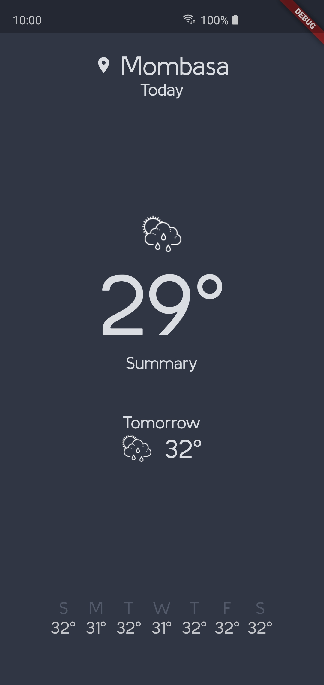

# weather_ui

A New weather flutter app .
Screenshots :

I managed to build my first Flutter App and the UI inspiration is from Dribble by awesome artist [Pavel] (https://dribbble.com/shots/4198066-Dailyui-Weather-App)
As I am a beginner , I know I did not use good codes , did not refactor well but am in the process of learning .

If you can contribute in any way please Do So , I'm adding more and more functionality to the App.

- [✔] : Managed to detect Cities Automatically according to the co-ordinates.
- [✔] : Successfully implemented DarkSky Weather API.
- [✔] : Added Summary , Min and Max Temperature.

### Todos
-For now the icon is static , I'm working on changing the icons according to the changes in the weather .

-Add more and more Functionality to test my skills and improve it.

## Getting Started

This project is a starting point for a Flutter application.

A few resources to get you started if this is your first Flutter project:

- [Lab: Write your first Flutter app](https://flutter.dev/docs/get-started/codelab)
- [Cookbook: Useful Flutter samples](https://flutter.dev/docs/cookbook)

For help getting started with Flutter, view our
[online documentation](https://flutter.dev/docs), which offers tutorials,
samples, guidance on mobile development, and a full API reference.
